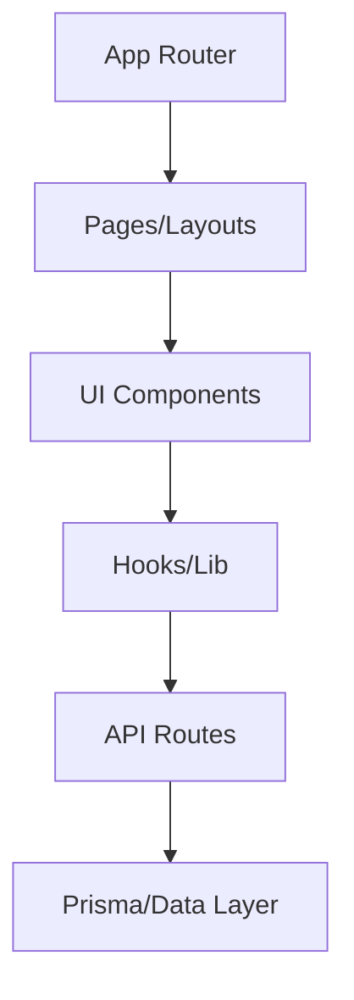
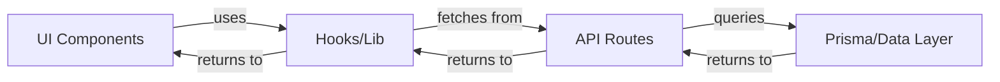

# Queue Hub

[Live Website (Vercel)](https://queue-hub-tau.vercel.app)

A modern, full-stack web application for discovering, tracking, and recommending movies and TV shows. Built for scalability, developer experience, and robust user management.

---

## Key Features

- **Authentication & Authorization**
  - Secure email/password auth (production disables sign-ups for demo security)
  - Session management with Prisma and Better Auth
  - API-level protection and defense-in-depth

- **Trending Content**
  - Infinite scrolling for trending movies and TV (TMDB API)
  - Server-side React Query hydration for fast initial loads

- **Watch Later List**
  - Add/remove movies and TV shows to personal watchlist
  - Optimistic UI updates and cache invalidation

- **User-to-User Recommendations**
  - Recommend any TMDB media to other users with a custom message
  - Recommendations appear in recipient’s watch later page
  - Duplicate prevention and sender/recipient tracking

- **Search**
  - Fast, client-side search for movies/TV with query length validation

- **Reusable UI Components**
  - Modular card, form, popover, avatar, and theme toggle components
  - Responsive, accessible, and theme-aware design

---

## Architecture & Design Choices

- **Layered Modular Monolith**
  - Clear separation: `app/` (routing), `components/` (UI), `lib/` (logic/hooks), `prisma/` (data), `public/` (assets)
  - Feature-oriented modules and query key factories
  - App Router for colocated layouts and server/client component separation

- **Scalability**
  - Centralized cache config for React Query
  - Infinite scroll with virtualization for large datasets
  - Optimized API endpoints and database queries

- **Patterns**
  - DRY, SOLID, separation of concerns, single responsibility
  - Query key factories and cache strategies for maintainable data fetching

---

## Architecture Diagram



### Component Relationships



---

## Frameworks, Libraries, and Tools

- **Next.js**: App Router, SSR/SSG, API routes, image optimization
- **React 19**: Modern hooks, concurrent features
- **Tailwind CSS**: Utility-first styling, dark mode, responsive design
- **Prisma**: PostgreSQL ORM, migrations, type-safe models
- **TanStack React Query**: Data fetching, caching, hydration, devtools
- **Better Auth**: Authentication, session, and adapter integration
- **React Hook Form**: Form state management and validation
- **Radix UI**: Accessible popovers, dialogs, tooltips
- **Zod**: Schema validation for forms and API
- **Sonner**: Toast notifications
- **DiceBear**: Avatar generation
- **Vitest & Testing Library**: Unit and integration tests (JSDOM)

### Data Source

This application uses the [TMDB API](https://www.themoviedb.org/documentation/api) but is not endorsed or certified by TMDB. All movie and TV show data is provided by TMDB.

### Tech Stack

|  |  |  |  |  |  |  |  |  |
| ----------------------------------------------------------------------- | --------------------------------------------------------------- | -------------------------------------------------------------------- | --------------------------------------------------------------------------------- | ------------------------------------------------------------------------------------ | ------------------------------------------------------------------- | ------------------------------------------------------------------------------- | ----------------------------------------------------------------------------- | ----------------------------------------------------------------------------------------------- |

---

## Authentication & Authorization

- **Better Auth** with Prisma adapter for secure, scalable user management
- Email/password login, session tokens, and trusted origins
- API routes protected by session checks
- Production disables sign-ups for demo security (configurable)

---

## State Management, Data Fetching, and Caching

- **React Query** for all async data (trending, watch later, recommendations)
- Centralized cache config (`lib/cache-config.ts`)
- Query key factories for modular, maintainable queries
- Optimistic updates and cache invalidation for mutations

---

## Reusable Components, Hooks, and Utilities

- **UI Components**: Card, Form, Popover, Avatar, Theme Toggle, Search Bar
- **Hooks**: useWatchLaterList, useInfiniteTrendingMovies, useBatchExternalIds, useAggregatedMediaData
- **Utilities**: Centralized cache, genre/title helpers, image URL helpers

---

## Performance Optimizations & Scalability

- **Infinite scroll** with window virtualization for trending content
- Server-side hydration for React Query
- Optimized cache durations for different data types
- Responsive, theme-aware UI

---

## Testing Strategies & CI/CD

- **Vitest**: Fast, modern unit/integration tests
- **Testing Library**: JSDOM-based UI tests for forms, navbar, auth flows
- **Coverage**: Text and HTML reports, excludes generated and UI boilerplate
- **Linting & Formatting**: ESLint (core-web-vitals, TypeScript, Prettier), strict rules

---

## Deployment Setup

- **Vercel**: Zero-config cloud deployment, image optimization, environment variables
- **Prisma**: Postinstall generates client, migrations for schema changes
- **CORS Middleware**: Secure API access for allowed origins

---

## Security, Maintainability, and Code Quality

- **Defense-in-depth**: API-level auth checks, CORS, production sign-up restrictions
- **Strict TypeScript**: Full type safety, Zod validation
- **Linting & Formatting**: Prettier, ESLint, strict config
  **Modular Structure**: Feature boundaries, reusable hooks/components

---

## Getting Started / Installation

```bash
# Clone the repo
git clone https://github.com/ay1610/queue-hub.git
cd queue-hub

# Install dependencies
npm install

# Set up environment variables

NEXT_PUBLIC_TMDB_API_KEY=your_tmdb_api_key
TMDB_API_KEY=your_tmdb_api_key
NEXT_PUBLIC_AUTH_URL=https://your-auth-url.com (optional)
TMDB_URL=https://api.themoviedb.org/3
NEXT_PUBLIC_TMDB_IMAGE_BASE_URL=https://image.tmdb.org/t/p
BETTER_AUTH_SECRET=your_better_auth_secret
DEV_USE_MOCK=false (use to mock db in dev)
DATABASE_URL=your_database_url

# Run database migrations
npx prisma migrate dev

# Start the development server
npm run dev
```

---

> ⚡️This README was conjured by AI (GitHub Copilot). Humans are safe, bugs may be mildly offended, and semicolons are living their best lives. Tested on caffeine, approved by coffee, and guaranteed to compile in your imagination. Thanks for reading to the end. You’ve earned a virtual high-five! ✋
